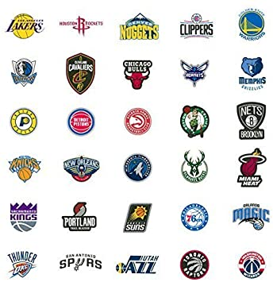

# NBA’s Winning Factor: How to Make Playoff




### [Project Result](/NBA’s Winning Factor_ How to Make Playoff)

+ This project is conducted by Sung In Cho (sc4393)

+ Project summary: This is an exploratory analysis for data collected from NBA. These days, many sport clubs are using statistical analysis to run the club more efficiently. Due to a development of technology, many types of data now can be collected from many sport games. Nowadays, sport of data does not only refer to baseball. Especially, basketball, for instance, also provides variety of large amount of data. We thought, it would be interesting to analyze sports data which is not about baseball. That’s why we made an analysis on NBA data. First, we wanted to figure out which factor is most influential on outcomes of games and, by extension, making playoff. Making the playoff is one of the most important goal of the season. It gives invaluable experience to the team. We thought key factors of winning one game and going to the playoffs may be different. There, we made two individual analyzations to see if there is really a difference. The source of the data is “http://stats.nba.com/ (http://stats.nba.com/)”. This page provides information of games and teams of the NBA. The match data are collected from 2014 to Nov 18th, 2016 and the season average data of teams are collected from 2006 to 2016.


```
proj/
├── data/
├── figs/
├── lib/
└── output/
```

Please see each subfolder for a README file.
